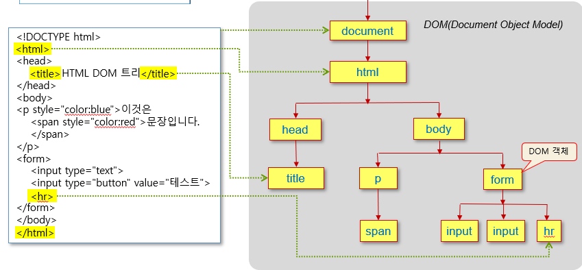

# review
### 2020 Web Programming

1. 웹 시스템의 클라이언트와 서버의 기능과 역할
    - 클라이언트
      - 사용자 인터페이스 담당
      - 웹 서버에 웹 문서를 요청하고 받아 사용자에게 출력
    - 서버
      - 웹 클라이언트의 요청을 받아 웹 문서 전송
      - 웹 서버로 작동하도록 하는 소프트웨어 실행
      - 웹 문서, 이미지, 동영상 등의 데이터 저장 관리

2. 웹 페이지 구성의 기본 3대 요소인 Markup 언어, Style 표현, 프로그래밍 언어의 기능 설명
    - Markup 언어: 웹페이지의 구조와 내용 
      - ex. HTML
    - Style 표현: 웹 페이지의 모양
      - ex. CSS(Cascading Style Sheet)
    - 프로그래밍 언어: 웹 페이지의 행동 및 응용 프로그램
      - ex. JavaScript

3. URL 주소 http://www.oracle.com:80/technetwork/java/index.html

   (a) 서버의 ip 주소를 찾을 때 사용되는 정보
      - www.oracle.com
  
   (b) 80은 무엇을 의미하는가?
      - 포트번호

   (c) technetwork/java/index.html는 무엇을 의미하는가?
      - 경로명, 웹 페이지 파일 이름
 
   (d) http는 무엇을 의미하는가? http 대신 ftp를 사용한다면 이는 무엇을 위한 것인가?
      - 프로토콜, 파일 전송

4. 다음과 같은 tag에 대해서 물음에 답하라.
   ```
   <!DOCTYPE html> <html> <head> <title> <body> <h1> <h6> <p> <hr> <br> <b>
   <strong> <pre> <div> <span> <a> <iframe> <base> <link> <script> <style>
   <meta>  <ol> <ul> <li> <table> <audio>
   ```
    (a) HTML5 페이지의 필수 태그들은 무엇인가? `<!DOCTYPE html>, <html>, <head>, <title>, <body>`

    (b) 단락을 나눌 때 사용되는 태그는 무엇인가? `<p>`

    (c) 블록 태그에 속하는 태그들을 기술하라.`<p>, <h1>, <div>, <ul>`

    (d) 인라인 태그에 속하는 태그들을 기술하라. `<strong>, <a>, , <span>`

    (e) HTML 페이지 내에 HTML 페이지를 삽입할 때 사용되는 태그는 무엇인가? `<iframe>`

    (f) 하이퍼링크(hyperlink)를 지정할 때 사용하는 태그와 속성은 무엇인가? `<a>`

    (g) 한 HTML 페이지 내의 특정 위치로 이동할 때 사용하는 태그 및 속성은 무엇인가? `<a id="move">, <a href="#move"> (속성 id사용, a태그 #id 이용)`

    (h) JavaScript 코드의 시작을 표시하는 코드는 무엇인가? `<script>`

    (i) 사용자가 HTML로 표현한 Enter 키 및 blank space 를 그대로 적용하여 포맷하는 데 사용되는 태그는 무엇인가? `<pre>`

5. 다음 HTML 코드의 의미를 설명하라.
    ```HTML
    
    ```
    - src="이미지 파일의 URL"
    - alt="문자열"
    - width="이미지 폭"
    - height="이미지 높이"
  
6. HTML5의 시맨틱 태그들을 써라. 또한, 이러한 태크들을 사용한 웹은 어떤 장점을 갖는가?

   `<header>, <nav>, <section>, <article>, <aside>, <footer>`

   `문서의 구조와 의미를 브라우저와 개발자 모두에게 명확하게 설명함.`

7. `<form>` 태그에 대한 적절한 것을 보기에서 골라 다음 글의 괄호를 채워라.

    > `<form>` 태그의 (__name__) 속성은 웹 서버 응용 프로그램의 이름을 지정하며, (__method__) 는 폼 데이터를 웹 서버로 전송할 때 데이터 전송 방식을 결정한다. 이 방식에는 (__GET__)과 (__POST__)이 있다. <br>
   >보기: name, post, target, action, value, submit, get, method

8. 다음 조건을 위한 `<form>` 을 작성하라.

    (1) 스핀 버튼으로 0에서 10까지 0.5 단위로 숫자를 입력받음.
    ```HTML
    <form>
        <input type="number" min="0.0" max="10.0" step="0.5">
    </form>
    ```
    (2) 달력에서 2016년 9월로 초기화 한 다음, 몇 월달 인지를 입력받음.
    ```HTML
    <form>
        <input type="month" value="2016-09">
    </form>
    ```

9.  `<span>`Hello!`</span>` 에 의해 출력되는 글자의 색이 blue 이고, 폰트의 크기가 20px 인 CSS3 스타일 시트를 작성하라.

    `<span style="color:blue; font-size:20px;">Hello!</span>`

10. 다음에서 `<div>` 아래의 `<strong>`에 있는 글자가 blue 가 되도록 하는 태그 셀렉터를 2가지 방법으로 정의하라 (즉, 출력되는 학습 내용 의 글자는 blue 가 됨)

    ```HTML
    <div> 2학기 <strong> 학습 내용</strong> </div>
    ```
    ```HTML
    <head>
    <style>
        strong{color: blue;}
    </style>
    </head>
    <body>
        <div> 2학기 <strong> 학습 내용</strong> </div>
    </body>
    ```
    ```HTML
    <div> 2학기 <strong style="color:blue;"> 학습 내용 </strong></div>
    ```

11. CSS3에서 빨간색 성분 136, 초록색 성분 43, 파란색 성분 226으로 구성된 색

    <p style="color:rgb(136,43,226)"> Color </p>

    -> __혼합된 보라색(bluevioler)__

12. 박스의 위치를 지정하는 position 배치 방법들을
    |배치방법|속성|
    |----|----|
    |정적 배치|static|
    |상대 배치|relative|
    |절대 배치|absolute|
    |고정 배치|fixed|
    |유동 배치|float : left 혹은 float : right|

13. z-index는 어떤 경우에 사용될 수 있나?
    - z축 공간 활용
    
14. 변수 x, y, z 중에 전역변수와 지역변수를 구분
    ```JavaScript
    var x;
    function f() {
    var y; x = 10; y = 10; z = 10;
    }
    ```
    전역변수: x, z
    지역변수: y

15. JavaScript의 3/2+"px" 의 연산 결과는 무엇인가?

    -> __1.5px__

16. 다음과 같은 JavaScript코드가 실행될 때와 동일한 결과를 갖도록, JavaScript를 사용하지 않고 오직 HTML코드 만으로 표현하라.
    ```HTML
    <body>
    <script>
    for(var size=10; size<=20; size+=5) {
    document.write("<span ");
    document.write("style='font-size:" + size + "px'>");
    document.write(size + "px");
    document.write("</span>");
    }
    </script>
    </body>
    ```
    __->__
    ```HTML
    <body>
        <span style="font-size: 10px;">10px</span>
        <span style="font-size: 15px;">15px</span>
        <span style="font-size: 20px;">20px</span>
    </body>
    ```

17. JavaScript로 n!을 계산하는 fac 함수를 한 문장으로 코딩하라.
    ```JavaScript
    function fac(n) {
    return n * fac(n-1);
    }
    ```

18. 다음 JavaScript 프로그램 코드가 어떤 방식으로 동작하는 지를 설명하라.
    ```HTML
    <body>
    <script>
    var bookArray = new Array();
    for(i=0; i<5; i++) {
    var input = prompt("책제목,저자,가격 입력", "Book1,홍길동,20000");
    var ar = input.split(",");
    var book = new Object();
    book.title = ar[0];
    book.author = ar[1];
    book.price = ar[2];
    bookArray[i] = book;
    }
    for(i=0; i<bookArray.length; i++) {
    document.write(bookArray[i].title + ", ");
    document.write(bookArray[i].author + ", ");
    document.write(bookArray[i].price + "<br>");
    }
    var most = bookArray[0];
    for(i=1; i<bookArray.length; i++) {
    if(bookArray[i].price > most.price)
    most = bookArray[i];
    }
    document.write("<hr>" + most.title);
    </script>
    </body>
    </html>
    ```
    

19. 0~99까지의 랜덤한 정수 10개를 생성하는 JavaScript 코드
    ```JavaScript
    for(i=0; i<10; i++) {
        var m = Math.random()*100;  // m은 0~99.999... 보다 작은 실수 난수
        var n = Math.floor(m); // m에서 소수점 이하를 제거한 정수 (0~99사이)
    }
    ```

20. Java Script의 객체 (Key:Value) 형태, Value 부분에 함수표현도 가능

    *객체 표현 : new 를 적용(예제 7-9) , 리터럴 표기법(7-10), 생성자 형태(7-11)*
    ```JavaScript
    //예제 7-9
    <script>
	//메소드로 사용할 3 개의 함수 작성
	function inquiry() { return this.balance; } // 잔금 조회
	function deposit(money) { this.balance += money; } // money 만큼 저금
	function withdraw(money) { // 예금 인출, money는 인출하고자 하는 액수
											// money가 balance보다 작다고 가정
		this.balance -= money; 
		return money;
	} 

	// 사용자 객체 만들기
	var account  = new Object(); 
	account.owner = "황기태"; // 계좌 주인 프로퍼티 생성 및 초기화
	account.code = "111"; // 코드 프로퍼티 생성 및 초기화
	account.balance = 35000; // 잔액 프로퍼티 생성 및 초기화
	account.inquiry = inquiry; // 메소드 작성
	account.deposit = deposit; // 메소드 작성
	account.withdraw = withdraw; // 메소드 작성
    </script>
    ```
    ```JavaScript
    //예제 7-10
    <script>
    var account = {
	// 프로퍼티 생성 및 초기화
	owner : "황기태", 		// 계좌 주인 프로퍼티 추가
	code : "111", 			// 계좌 코드 프로퍼티 추가
	balance : 35000, 		// 잔액 프로퍼티 추가

	// 메소드 작성
	inquiry : function () { return this.balance; }, // 잔금 조회
	deposit : function(money) { this.balance += money; }, // 저금. money 만큼 저금
	withdraw : function (money) { // 예금 인출, money는 인출하고자 하는 액수
		// money가 balance보다 작다고 가정
		this.balance -= money; 
		return money;
	    } 
    };
    </script>
    ```
    ```JavaScript
    //예제 7-11 
    <script>
	// 프로토타입 만들기 : 생성자 함수 작성
	function Account(owner, code, balance) {
		// 프로퍼티 만들기
		this.owner = owner; 	// 계좌 주인 프로퍼티 만들기 
		this.code = code; 		// 계좌 코드 프로퍼티 만들기 
		this.balance = balance; // 잔액 프로퍼티 만들기 
		
		// 메소드 만들기
		this.inquiry = function () { return this.balance; }
		this.deposit = function (money) { this.balance += money; } 
		this.withdraw = function (money) { // 예금 인출, money는 인출하는 액수
			// money가 balance보다 작다고 가정
			this.balance -= money; 
			return money;
		} 
	};
    </script>
    <body>
        <script>
            // new 연산자 이용하여 계좌 객체 생성
            var account = new Account("황기태", "111", 35000);
    ```


21. Java Script의 배열 생성 방법 2가지
    ```JavaScript
    var week = [“월”, “화”, “수”, “목”, “금”, “토”, “일”];
    var week = new Array(“월”, “화”, “수”, “목”, “금”, “토”, “일”);
    ```

22. DOM Tree
    - HTML에 해당되는 DOM 트리 그리기
        
    - 이벤트 핸들러 코딩하기 (8장의 여러 예제 코드)- event handler: onclick, onmouseover, onmousedown, onload, onclick …

    - DOM의 element 검색하는 메소드 이름 및 검색 방법

    - DOM의 element를 추가/삭제가 발생하는 메소드 및 추가/삭제가 발생하였을 때의 DOM트리 모습과 HTML 모습 (슬라이드 예제 8-10)
